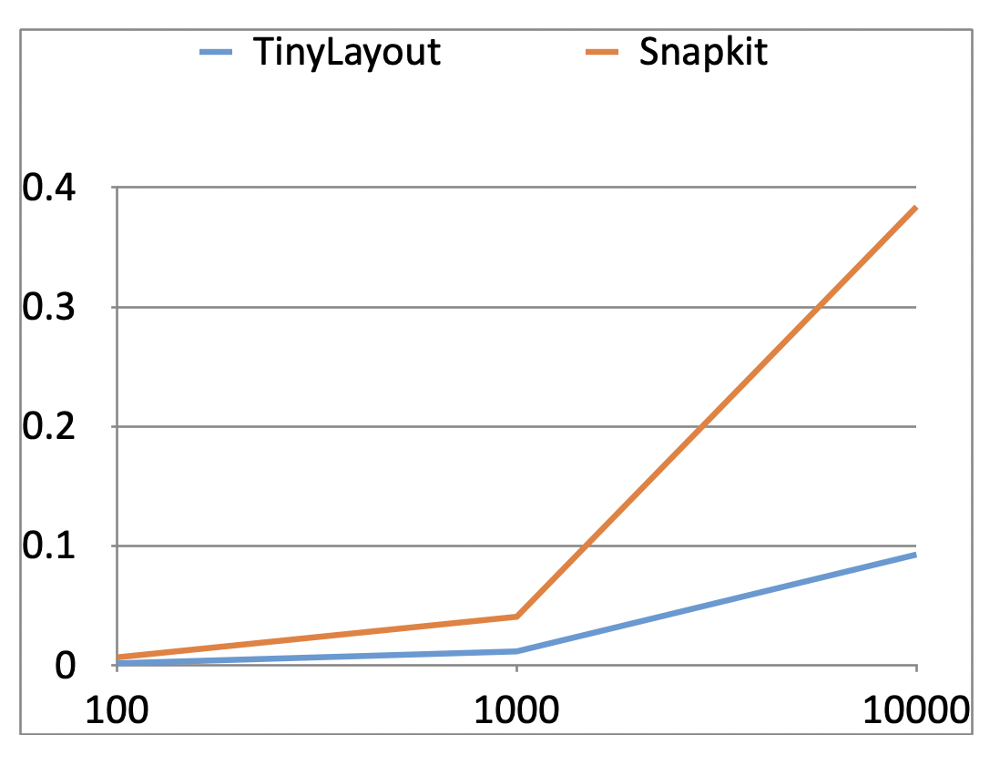

# TinyLayoutMetrics

## 测试方案

1. 使用Tinylayout、SnapKit (5.6.0)分别remake如下约束 100、 1000、 10000 次

```swift
view.ty.remakeConstraints { view, superView in
    view.leading == superView.leading + 15
    view.centerY == superView.centerY
    view.width == 100~100
    view.width == 32
    view.height == 32
}
```

```swift
view.snp.remakeConstraints { maker in
    maker.leading.equalToSuperview().offset(15)
    maker.centerY.equalToSuperview()
    maker.width.equalTo(100).priority(100)
    maker.width.equalTo(32)
    maker.height.equalTo(32)
}
```

2. 使用SnapKit的测试用例测试TinyLayout

## 结果

1. TinyLayout 效率高于 Snapkit



2. TinyLayout通过了所有测试用例（共31组）

## Raw Data

```

Test Suite 'TinyLayoutMetricsTests' started at 2022-11-10 11:08:03.029
Test Case '-[TinyLayoutMetricsTests.TinyLayoutMetricsTests testPerformance_snapkit_large]' started.
/TinyLayoutMetrics/TinyLayoutMetricsTests/TinyLayoutMetricsTests.swift:79: Test Case '-[TinyLayoutMetricsTests.TinyLayoutMetricsTests testPerformance_snapkit_large]' measured [Time, seconds] average: 0.384, relative standard deviation: 2.157%, values: [0.398479, 0.380680, 0.378752, 0.384508, 0.394732, 0.374868, 0.376316, 0.379461, 0.377093, 0.394567], performanceMetricID:com.apple.XCTPerformanceMetric_WallClockTime, baselineName: "", baselineAverage: , polarity: prefers smaller, maxPercentRegression: 10.000%, maxPercentRelativeStandardDeviation: 10.000%, maxRegression: 0.100, maxStandardDeviation: 0.100
Test Case '-[TinyLayoutMetricsTests.TinyLayoutMetricsTests testPerformance_snapkit_large]' passed (4.142 seconds).
Test Case '-[TinyLayoutMetricsTests.TinyLayoutMetricsTests testPerformance_snapkit_mid]' started.
/TinyLayoutMetrics/TinyLayoutMetricsTests/TinyLayoutMetricsTests.swift:93: Test Case '-[TinyLayoutMetricsTests.TinyLayoutMetricsTests testPerformance_snapkit_mid]' measured [Time, seconds] average: 0.041, relative standard deviation: 20.976%, values: [0.066091, 0.039936, 0.038187, 0.039479, 0.038628, 0.037077, 0.036840, 0.036989, 0.036943, 0.036779], performanceMetricID:com.apple.XCTPerformanceMetric_WallClockTime, baselineName: "", baselineAverage: , polarity: prefers smaller, maxPercentRegression: 10.000%, maxPercentRelativeStandardDeviation: 10.000%, maxRegression: 0.100, maxStandardDeviation: 0.100
Test Case '-[TinyLayoutMetricsTests.TinyLayoutMetricsTests testPerformance_snapkit_mid]' passed (0.662 seconds).
Test Case '-[TinyLayoutMetricsTests.TinyLayoutMetricsTests testPerformance_snapkit_small]' started.
/TinyLayoutMetrics/TinyLayoutMetricsTests/TinyLayoutMetricsTests.swift:107: Test Case '-[TinyLayoutMetricsTests.TinyLayoutMetricsTests testPerformance_snapkit_small]' measured [Time, seconds] average: 0.007, relative standard deviation: 39.634%, values: [0.013521, 0.008423, 0.007054, 0.006238, 0.005756, 0.005403, 0.005004, 0.004875, 0.004602, 0.004574], performanceMetricID:com.apple.XCTPerformanceMetric_WallClockTime, baselineName: "", baselineAverage: , polarity: prefers smaller, maxPercentRegression: 10.000%, maxPercentRelativeStandardDeviation: 10.000%, maxRegression: 0.100, maxStandardDeviation: 0.100
Test Case '-[TinyLayoutMetricsTests.TinyLayoutMetricsTests testPerformance_snapkit_small]' passed (0.319 seconds).
Test Case '-[TinyLayoutMetricsTests.TinyLayoutMetricsTests testPerformance_tiny_large]' started.
/TinyLayoutMetrics/TinyLayoutMetricsTests/TinyLayoutMetricsTests.swift:37: Test Case '-[TinyLayoutMetricsTests.TinyLayoutMetricsTests testPerformance_tiny_large]' measured [Time, seconds] average: 0.093, relative standard deviation: 9.664%, values: [0.119524, 0.090097, 0.089821, 0.089574, 0.089295, 0.089622, 0.089590, 0.089613, 0.089464, 0.090064], performanceMetricID:com.apple.XCTPerformanceMetric_WallClockTime, baselineName: "", baselineAverage: , polarity: prefers smaller, maxPercentRegression: 10.000%, maxPercentRelativeStandardDeviation: 10.000%, maxRegression: 0.100, maxStandardDeviation: 0.100
Test Case '-[TinyLayoutMetricsTests.TinyLayoutMetricsTests testPerformance_tiny_large]' passed (1.179 seconds).
Test Case '-[TinyLayoutMetricsTests.TinyLayoutMetricsTests testPerformance_tiny_mid]' started.
/TinyLayoutMetrics/TinyLayoutMetricsTests/TinyLayoutMetricsTests.swift:51: Test Case '-[TinyLayoutMetricsTests.TinyLayoutMetricsTests testPerformance_tiny_mid]' measured [Time, seconds] average: 0.012, relative standard deviation: 39.162%, values: [0.025070, 0.015720, 0.012622, 0.011271, 0.010439, 0.009838, 0.009296, 0.009048, 0.009038, 0.009050], performanceMetricID:com.apple.XCTPerformanceMetric_WallClockTime, baselineName: "", baselineAverage: , polarity: prefers smaller, maxPercentRegression: 10.000%, maxPercentRelativeStandardDeviation: 10.000%, maxRegression: 0.100, maxStandardDeviation: 0.100
Test Case '-[TinyLayoutMetricsTests.TinyLayoutMetricsTests testPerformance_tiny_mid]' passed (0.374 seconds).
Test Case '-[TinyLayoutMetricsTests.TinyLayoutMetricsTests testPerformance_tiny_samll]' started.
/TinyLayoutMetrics/TinyLayoutMetricsTests/TinyLayoutMetricsTests.swift:65: Test Case '-[TinyLayoutMetricsTests.TinyLayoutMetricsTests testPerformance_tiny_samll]' measured [Time, seconds] average: 0.002, relative standard deviation: 43.215%, values: [0.005090, 0.003366, 0.002529, 0.002482, 0.002255, 0.002112, 0.002150, 0.001675, 0.001332, 0.001367], performanceMetricID:com.apple.XCTPerformanceMetric_WallClockTime, baselineName: "", baselineAverage: , polarity: prefers smaller, maxPercentRegression: 10.000%, maxPercentRelativeStandardDeviation: 10.000%, maxRegression: 0.100, maxStandardDeviation: 0.100
Test Case '-[TinyLayoutMetricsTests.TinyLayoutMetricsTests testPerformance_tiny_samll]' passed (0.284 seconds).
Test Suite 'TinyLayoutMetricsTests' passed at 2022-11-10 11:08:09.990.
	 Executed 6 tests, with 0 failures (0 unexpected) in 6.960 (6.961) seconds
```

